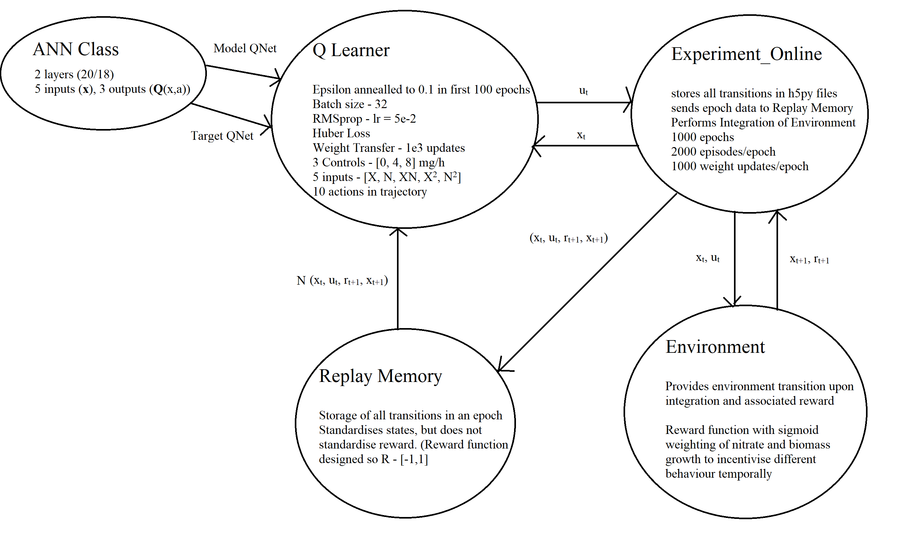

# PolicyGradient
Repository for dynamic optimisation of simple fed-batch fermentation with Deep Policy Gradient Network.

### ExpDesign.py 
 - File is central integrator that runs the program

### PolicyGradient.py 
- Defines the Policy Net as well as the hyperparameters associated with training, such as net configuration etc.
Policy Net predicts the mean and std of gaussian distribution over action space. ANN has a sigmoid activation function in the output layer.
- The mean and std then transformed to acceptable range under affine transform i.e. Y = M.X + C, where C is lower bound on action space
and M is the acceptable operating range.
- Normalisation of states (via fixed min and max values) and synthetic generation of state information via use of polynomial representation (as in DQN).

### Experiment_Online.py 
- Enables integration of decision making of the agent with dynamics of the environment and steps
environment to the next time step, over a number of episodes of experience and training rounds/epochs. Observes reward and logP of every action in each episode and sends to Replay_Memory

### Replay_Memory.py
- Stores all reward from s-a pairs and logP of associated action over an epoch. Then called by PolicyGradient.py file where policy gradient is calculated for that epoch

### Environment_file.py
- Contains definition of the bioprocess we want to dynamically optimise.

